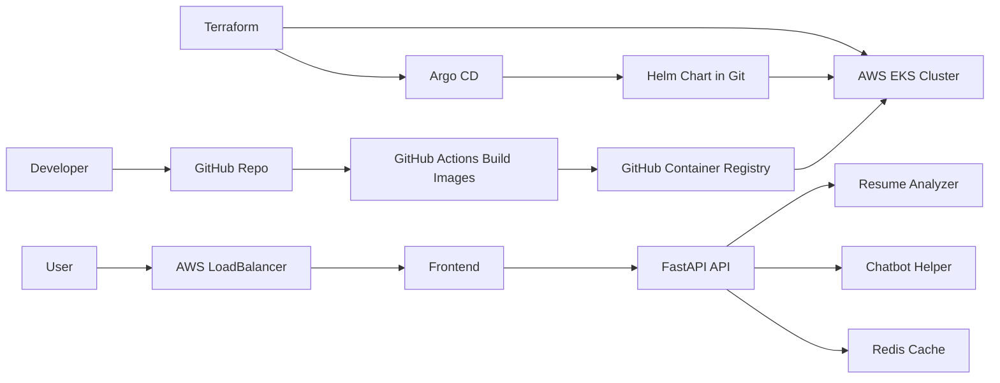

# AI Resume Analyzer and Chatbot on EKS

A complete beginner-friendly cloud project: a FastAPI resume analyzer, a frontend UI, Docker images, Terraform-created AWS EKS infrastructure, and Argo CD GitOps deployment.

It includes:

- FastAPI backend
- Frontend web app
- Docker and Docker Compose
- Optional Redis cache
- Nginx reverse proxy
- Prometheus and Grafana monitoring
- GitHub Actions CI
- Terraform AWS EKS deployment
- Argo CD GitOps staging/prod apps
- Beginner docs explaining the full flow

## Project Flow



## Folder Structure

```text
apps/resume-ai-api/          FastAPI app source, tests, Dockerfile
apps/resume-ai-web/          Frontend source and Dockerfile
infra/terraform/eks/         Terraform VPC, EKS, node group, Argo CD
infra/monitoring/            Prometheus and Grafana config
.github/workflows/           CI and image build automation
platform/helm/resume-ai/     Kubernetes Helm chart
platform/gitops/argocd/      Argo CD app definitions
docs/                        Beginner, architecture, EKS, Argo CD guides
docker-compose.yml           Local full-stack runner
```

## Run Locally Without Docker

Prerequisites:

- Python 3.11+

```bash
cd apps/resume-ai-api
python -m venv .venv
.venv\Scripts\activate
pip install -e ".[dev]"
uvicorn resume_ai_api.main:app --reload --port 8000
```

Open:

- API docs: <http://localhost:8000/docs>
- Health: <http://localhost:8000/health/ready>
- Metrics: <http://localhost:8000/metrics>

To preview the frontend without Docker, open a second terminal:

```bash
cd apps/resume-ai-web
python -m http.server 8080
```

Then open <http://localhost:8080>.

## Run Locally With Docker

Prerequisites:

- Docker Desktop

```bash
docker compose up --build
```

Open:

- Frontend app: <http://localhost>
- API docs through Nginx: <http://localhost/docs>
- Prometheus: <http://localhost:9090>
- Grafana: <http://localhost:3000>

Grafana default login is `admin` / `admin`.

## Try The API

In Swagger UI at `/docs`, open `POST /api/v1/analyze` and use:

```json
{
  "role_title": "Backend Developer",
  "resume_text": "Python developer built FastAPI APIs with Docker, Redis, AWS EKS, Terraform, Argo CD, Prometheus and GitHub Actions CI/CD.",
  "job_description": "We need a backend developer with Python, FastAPI, Docker, AWS EKS, Redis, Terraform, Argo CD, CI/CD, monitoring and REST API experience."
}
```

You will get a score, matched keywords, missing keywords, strengths, improvements, and a suggested summary.

## Tests

```bash
make test
make lint
```

## Deploy To AWS EKS With Terraform And Argo CD

Start here:

- [docs/terraform-eks-argocd-guide.md](docs/terraform-eks-argocd-guide.md)
- [docs/gitops-flow.md](docs/gitops-flow.md)

The short version is: Terraform creates EKS and installs Argo CD. GitHub Actions builds Docker images. Argo CD reads the Helm chart from Git and deploys the frontend/API into Kubernetes.

## Beginner Code Guide

Start here: [docs/beginner-guide.md](docs/beginner-guide.md)

The most important file is:

- `apps/resume-ai-api/src/resume_ai_api/main.py`

It creates the FastAPI app and exposes the routes.
